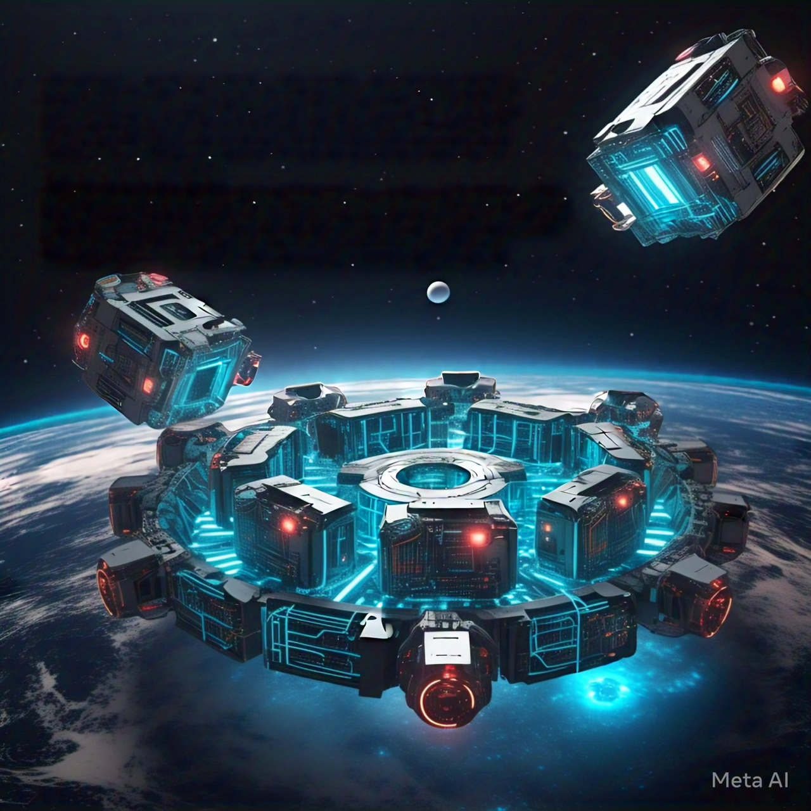

# C++20 Modules - simple demo

This project is the code companion for these blog posts:

- [Introduction to C++20 Modules](https://codetrips.com/2025/02/26/introduction-to-modules/)
- [C++20 Modules in CLion](https://codetrips.com/2025/03/02/introduction-to-c20-modules-part-2/)

Please refer to those for an explanation of the code.
